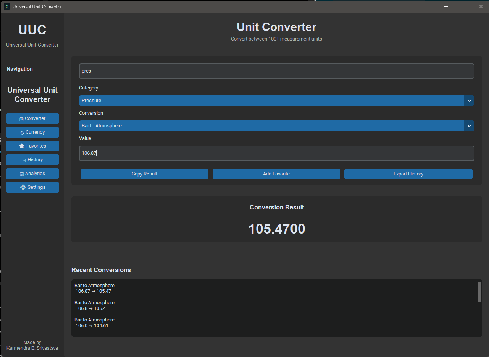
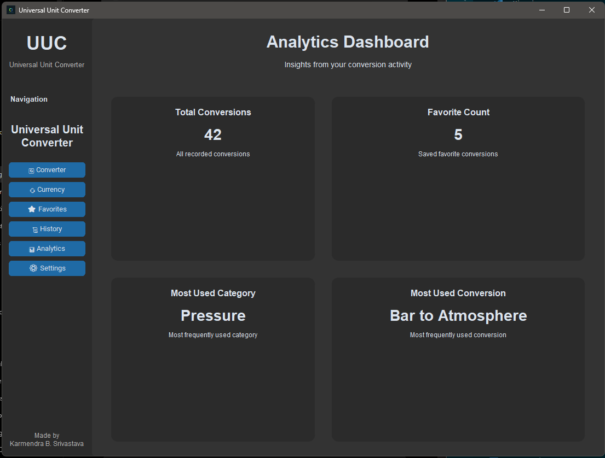
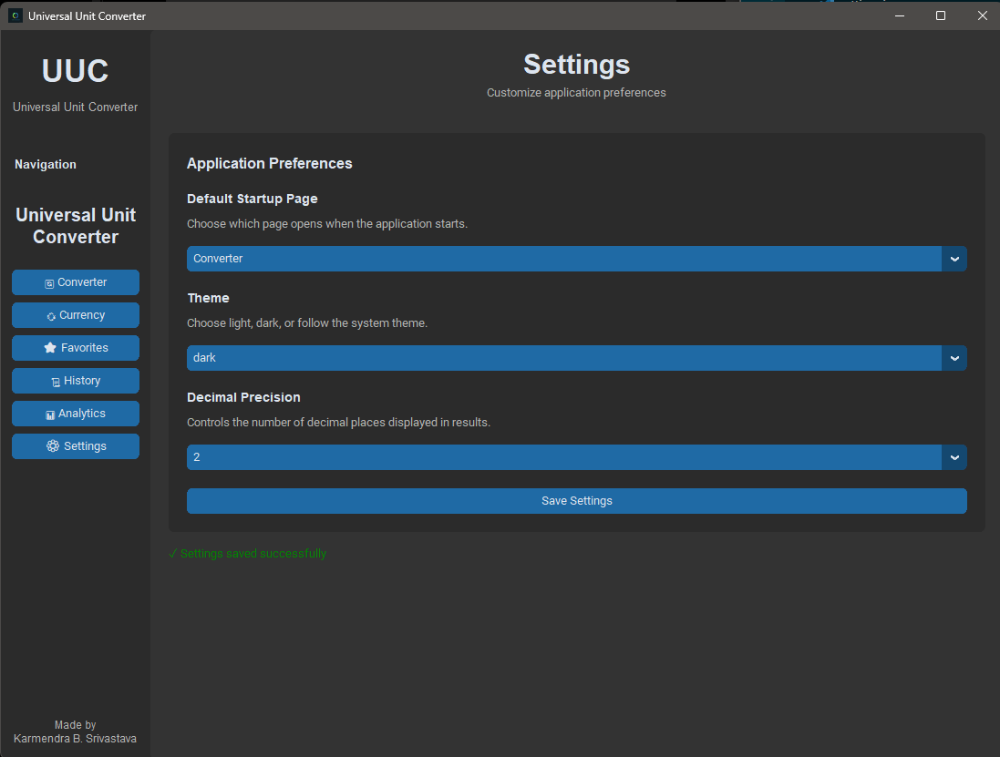

# Universal Unit Converter

A modern desktop application built with **CustomTkinter** that supports **25+ conversion categories**, **real-time currency conversion**, **favorites management**, **conversion history tracking**, **analytics insights**, and customizable application settings through a clean and intuitive user interface.

---

## Screenshots

### Converter Page



### Currency Converter


### Analytics Dashboard



### Settings



---

## Project Layout

```text
Universal Unit Converter/
│
├── data/
│
├── exports/
│
├── screenshots/
│   ├── converter.png
│   ├── currency.png
│   ├── analytics.png
│   └── settings.png
│
├── src/
│   ├── converter/
│   │   ├── analytics.py
│   │   ├── config.py
│   │   ├── conversions.py
│   │   ├── currency.py
│   │   ├── currency_favorites.py
│   │   ├── engine.py
│   │   ├── exceptions.py
│   │   ├── export.py
│   │   ├── favorites.py
│   │   ├── history.py
│   │   ├── models.py
│   │   ├── search.py
│   │   ├── settings.py
│   │   └── utils.py
│   │
│   └── ui/
│       └── desktop/
│           ├── app.py
│           └── pages/
│
├── main.py
├── requirements.txt
├── README.md
└── LICENSE
```

---

## Quickstart

### 1. Create and Activate a Virtual Environment

```bash
python -m venv .venv
```

Windows:

```bash
.venv\Scripts\activate
```

Linux / macOS:

```bash
source .venv/bin/activate
```

### 2. Install Dependencies

```bash
pip install -r requirements.txt
```

### 3. Run the Application

```bash
python main.py
```

---

## Features

* 25+ conversion categories.
* Real-time currency conversion.
* Exchange rate caching for improved performance.
* Favorites management system.
* Conversion history tracking.
* Analytics dashboard with usage statistics.
* Customizable light, dark, and system themes.
* Adjustable decimal precision.
* Configurable startup page.
* CSV export support.
* Modern desktop interface powered by CustomTkinter.
* Modular architecture with clear separation of UI and business logic.

---

## Supported Categories

* Length
* Weight
* Temperature
* Time
* Volume
* Data Storage
* Speed
* Pressure
* Area
* Energy
* Power
* Angle
* Fuel Economy
* Frequency
* Force
* Torque
* Density
* Electric Current
* Voltage
* Electric Resistance
* Magnetic Field
* Astronomy
* Cooking
* Paper Size
* Sound
* Radiation
* Currency Conversion

---

## Architecture

### Conversion Engine

Handles all unit conversion operations and serves as the central business logic layer.

### Currency Service

Fetches exchange rates from an external API and maintains a local cache for faster access.

### History Manager

Stores and retrieves conversion history records.

### Favorites Manager

Provides persistent storage for favorite conversions.

### Analytics Manager

Generates user activity statistics and usage insights.

### Settings Manager

Handles application preferences such as theme selection, startup page, and decimal precision.

### Desktop User Interface

Built with CustomTkinter using a multi-page dashboard architecture.

---

## Technologies Used

* Python 3.13
* CustomTkinter
* Requests
* JSON Storage
* Dataclasses
* pathlib

---

## Future Improvements

* Additional conversion categories.
* Enhanced analytics and visual reporting.
* Advanced search and filtering.
* Multiple export formats.
* Improved accessibility options.
* Offline currency conversion fallback.

---

## Author

**Karmendra B. Srivastava**

Built as a desktop application project to provide a fast, modern, and extensible conversion experience.

---

## License

This project is licensed under the MIT License. See the LICENSE file for details.
